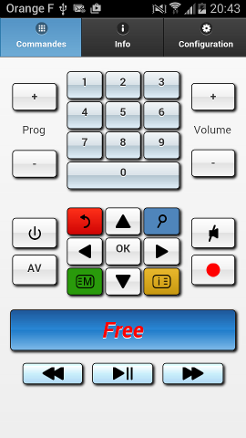
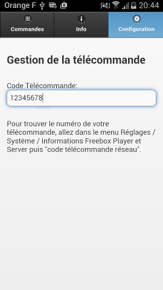

Freebox Zapper pour Android
===========================

*English abstract:* this project is related to the French set-top box Freebox. So the following explanations will be in French. It is about a soft remote control for mobile Android-based phones. As it is a project so I can test JQuery mobile and Cordova - and as the API used is quite simple - it is written as a WebApp.

 

Fonctionnalités
---------------

-	Freebox v6 supporté
-	Dédié au contrôle TV
-	Contrôle via WiFi, ne fonctionne pas en 3G/4G
-	Complémentaire à votre télécommande, ne se substitue pas à elle
-	Mouvements et appuis longs non pris en compte

Play Store
----------

Pour facilité, test et courtoisie, [l'outil est disponible sur le Play Store](https://play.google.com/store/apps/details?id=net.alea.freebox.zapper.webapp).

Utilisation
-----------

Node.js et Cordova sont nécessaires pour préparer le logiciel.

Si vous n'avez pas Cordova :

```
$ sudo npm install -g cordova
```

Vous devez rajouter les plateformes à supporter. Seul Android est sûr d'être pris en compte à 100%, mais cela devrait marcher sous iOS.

```
$ cordova platform add ios
$ cordova platform add android
```

Pour enfin générer les projets Android Studio et XCode :

```
$ cordova build
```

API Freebox & restrictions
--------------------------

L'API utilisée est celle basée sur HTTP, détaillée ici : http://www.freenews.fr/spip.php?article8202

Elle est très simple d'utilisation, puiqu'un appui sur une touche de télécommande revient à envoyer un message HTTP GET du type : http://hd1.freebox.fr/pub/remote_control?key=code_touche&code=code_telecommande

Une API basée sur la couche transport UDP et bien plus complète est disponible ici : http://dev.freebox.fr/sdk/

C'est bien sûr difficile (voire impossible, en fait, sauf rajout de plugins ou autre) de faire ça avec une seule WebView. Ne souhaitant pas passer trop de temps sur la mise en oeuvre de ce logiciel, et souhaitant tester JQuery Mobile, le choix du protocole Freebox sur UDP n'a pas été retenu.

Concernant ce logiciel
----------------------

D'autres systèmes de télécommande pour Freebox existent. J'étais cependant mal à l'aise à l'idée d'utiliser un logiciel créé par autrui pour commander ma Freebox. En effet, lorsqu'on donne comme autorisation l'accès réseau complet à un logiciel, ce dernier peut très bien envoyer des statistiques sur mon utilisation de la Freebox à une autre personne.

J'ai donc préféré faire mon propre logiciel. Je suis ainsi sûr de ce qu'il contient. Dans la mesure où il a été vite fait (WebView + JQuery Mobile), celui-ci est uniquement dédié à la Freebox v6 pour des commandes simples (TV).

Eventuellement, le jour où l'ancien système de Freebox par HTTP ne sera plus supporté, l'outil évoluera peut-être et corrigera alors ces limitations.

License et auteur
-----------------

Freebox Zapper - Télécommande pour Freebox

Copyright (C) 2012 Vincent Hiribarren — Tous droits réservés.

Ce programme est un logiciel libre ; vous pouvez le redistribuer ou le modifier suivant les termes de la “GNU General Public License” telle que publiée par la Free Software Foundation : soit la version 3 de cette licence, soit (à votre gré) toute version ultérieure.

Ce programme est distribué dans l’espoir qu’il vous sera utile, mais SANS AUCUNE GARANTIE : sans même la garantie implicite de COMMERCIALISABILITÉ ni d’ADÉQUATION À UN OBJECTIF PARTICULIER. Consultez la Licence Générale Publique GNU pour plus de détails.

Vous devriez avoir reçu une copie de la Licence Générale Publique GNU avec ce programme ; si ce n’est pas le cas, consultez :http://www.gnu.org/licenses/.

---

Freebox Zapper - Remote control for the Freebox

Copyright (C) 2012 Vincent Hiribarren

This program is free software: you can redistribute it and/or modify it under the terms of the GNU General Public License as published by the Free Software Foundation, either version 3 of the License, or (at your option) any later version.

This program is distributed in the hope that it will be useful, but WITHOUT ANY WARRANTY; without even the implied warranty of MERCHANTABILITY or FITNESS FOR A PARTICULAR PURPOSE. See the GNU General Public License for more details.

You should have received a copy of the GNU General Public License along with this program. If not, see http://www.gnu.org/licenses/.
